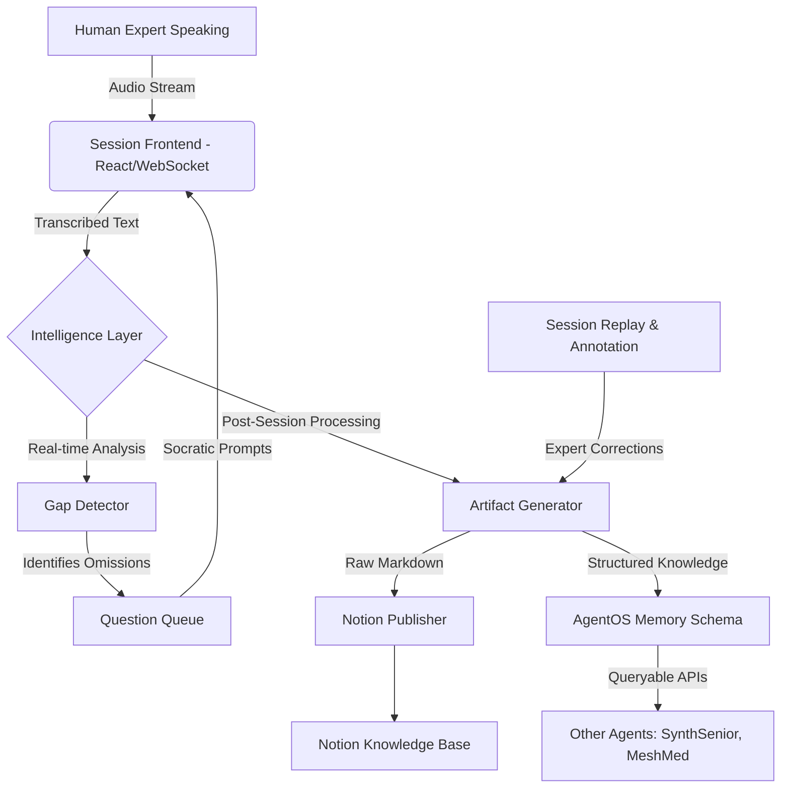

# OralLex Architecture

OralLex acts as the central nervous system for organizational knowledge capture. It bridges the gap between tacit human expertise and the AgentOS shared memory.

## High-Level Architecture

## Module Breakdown

### 1. `oralex/intelligence/gap_detector.py`
The core reasoning engine. It processes sliding windows of the transcript against predefined heuristic patterns (e.g., words like "obviously", "usually", "just"). It then uses an LLM to evaluate if a true knowledge gap exists and formulates a contextual Socratic question to extract the missing context.

### 2. `oralex/artifacts/generator.py`
The compilation engine. Once a session concludes, it takes the raw transcript, merges it with the answers provided to the Socratic questions, and structures the output. It supports multiple `ArtifactType` enums (SOP, FAQ, DECISION_TREE) and formats them cleanly into Markdown.

### 3. `oralex/integrations/notion.py`
Handles the non-trivial conversion of raw Markdown into the `api.notion.com/v1/` block schema structure, handling headings, bullet points, and code blocks to ensure the artifacts look native in the company wiki.

### 4. `oralex/frontend/session.html`
A highly optimized, single-page application built with React and Tailwind. It connects via WebSockets to stream audio, receive live transcriptions, and display the Socratic Question Queue without overwhelming the user.

### 5. `oralex/replay/`
Allows experts to asynchronously review past sessions. They can highlight specific text blocks to annotate them (e.g., flagging a section as "Critical" or "Needs Revision"), which triggers the Artifact Generator to rebuild the documents.

### 6. `oralex/agentOS/knowledge_graph_api.py`
This is how OralLex empowers the rest of the swarm. It writes extracted knowledge directly to `agentOS:memory:knowledge:{org_id}`. When another agent like `SynthSenior` needs to understand "Why does this specific legacy module exist?", it queries this API to pull the SOP generated by OralLex during a past engineering session.
